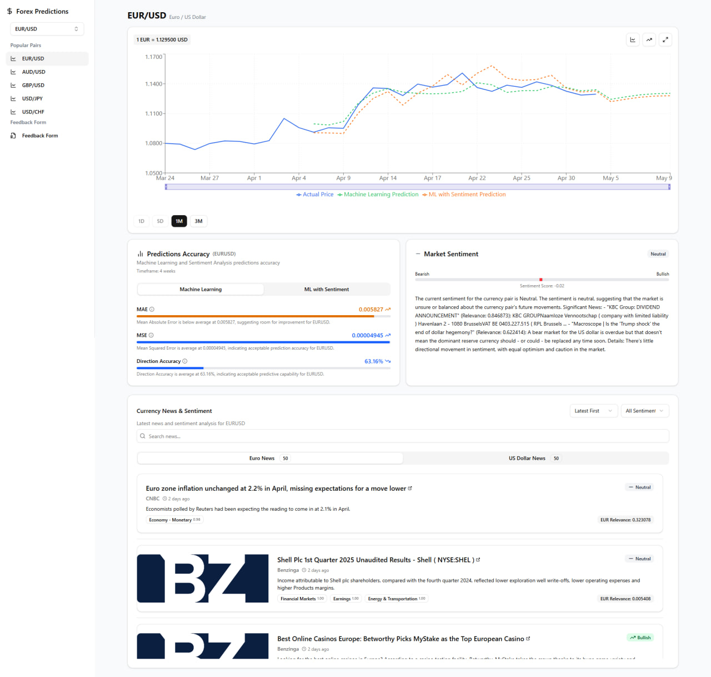
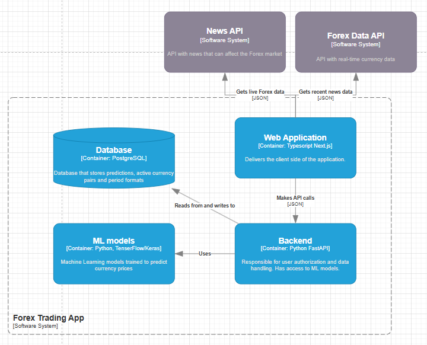

# Forex Predictions Platform



A full-stack platform for predicting forex currency pairs using machine learning. This project includes a web client, a Python-based machine learning training pipeline, and a FastAPI server for serving predictions and managing data.


---

## Table of Contents
- [Overview](#overview)
- [Features](#features)
- [Architecture](#architecture)
- [Project Structure](#project-structure)
- [Quick Start](#quick-start)
- [Client (Next.js)](#client-nextjs)
- [ML Training (Python)](#ml-training-python)
- [Server (FastAPI)](#server-fastapi)
- [Contributing](#contributing)
- [License](#license)

---

## Overview
This platform enables users to:
- View and analyze forex predictions for major currency pairs
- Run and train ML models for price forecasting
- Visualize model performance and statistics
- Search for symbols and view sentiment analysis

## Features
- **Modern Next.js web client** for interactive charts and analytics
- **FastAPI backend** for serving predictions and managing data
- **Python ML pipeline** for training LSTM models on historical forex data
- **Database integration** for storing predictions and statistics
- **Sentiment analysis** support

---

## Architecture



---

## Project Structure
```
forex-predictions/
│
├── client/         # Next.js web client (frontend)
├── ml-training/    # Python scripts for ML model training
├── server/         # FastAPI backend server
│   └── README.md   # See for API details
├── website-screenshot.jpg
├── architecture.png
└── README.md       # (this file)
```

---

## Quick Start

### 1. Clone the repository
```bash
git clone <repo-url>
cd forex-predictions
```

### 2. Set up the server
See [`server/README.md`](server/README.md) for detailed instructions.

### 3. Set up the client
See [`client/README.md`](client/README.md) for frontend setup and usage.

### 4. Train ML models
See [`ml-training/README.md`](ml-training/README.md) for training and data preparation.

---

## Client (Next.js)
- Modern React/Next.js app
- Interactive charts, symbol search, sentiment analysis
- See [`client/README.md`](client/README.md) for setup and usage

## ML Training (Python)
- Scripts for preprocessing, training, and evaluating LSTM models
- Data in `ml-training/data/`
- See [`ml-training/README.md`](ml-training/README.md) for details

## Server (FastAPI)
- REST API for predictions, currency pairs, and database management
- See [`server/README.md`](server/README.md) for endpoints and usage

---

## Contributing
Pull requests and issues are welcome! Please see the individual READMEs for contribution guidelines for each part.

## License
MIT License. See `LICENSE` file for details.
